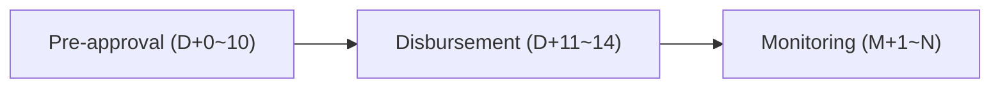
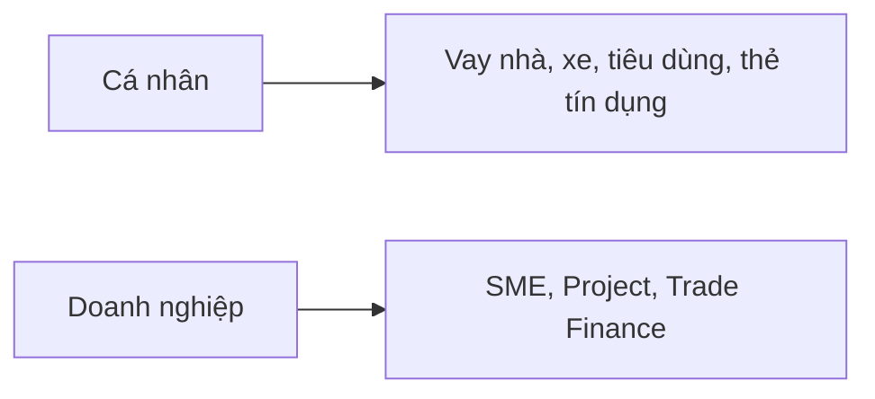

CREDIT STRATEGY • Q2 2026

# Logic Tree Lending

*Phân khúc khách hàng, logic xét duyệt và quy trình cho vay end-to-end*

Một khung phân tích thống nhất từ segmentation đến giải ngân — gồm cây phân khúc, ma trận sản phẩm, logic xét duyệt 7 bước và timeline xử lý hồ sơ.

Credit Strategy Team • May 2026

---

## Agenda

### Tổng quan nội dung

| | | | |
|---|---|---|---|
| **01** | **02** | **03** | **04** |
| **Segment Tree** | **Product Matrix** | **Decision Logic** | **Timeline** |
| Cây phân khúc 3 cấp: Customer → Sub-Segment → Product | 18 sản phẩm cho vay với Min/Max loan và lãi suất | Quy trình 7 bước xét duyệt KYC → Credit → DTI → Approve | Lộ trình end-to-end D+0 → M+1~N |

*Mỗi phần hỗ trợ một tác vụ cụ thể: xây danh mục, định nghĩa sản phẩm, thiết kế credit policy, và đo SLA xử lý.*

---

## 01 · SEGMENT TREE

### Cây phân khúc khách hàng vay

SEGMENT TREE — Phân khúc khách hàng vay
- Root: KHÁCH HÀNG VAY
  - KH CÁ NHÂN (Individual)
    - KH Ưu tiên (Priority)
      - Vay mua nhà
      - Vay mua xe
      - Thẻ tín dụng
    - KH Phổ thông (Mass)
      - Vay tiêu dùng
      - Vay mua xe
      - Vay du học
    - KH TN thấp (Low-income)
      - Vay tín chấp
      - Vay trả góp
      - Microloan
  - KH DOANH NGHIỆP (Corporate)
    - Micro Business
      - Vay vốn lưu động
      - Vay TS cố định
      - OD ngắn hạn
    - SME
      - Vay đầu tư
      - Tài trợ TM
      - Vay dự án
    - Large Corporate
      - Syndicated Loan
      - Project Finance
      - Trade Finance

Cấu trúc 3 cấp: Customer Type → Sub-Segment → Loan Products

↳ 1 root → 2 customer types → 6 sub-segments → 18 loan products

---

## 02 · PRODUCT MATRIX

### Ma trận sản phẩm theo phân khúc

| Segment ID | Customer Type | Sub-Segment | Product | Min (VNDm) | Max (VNDm) | Rate | % Portfolio |
|---|---|---|---|---|---|---|---|
| **IND-001** | Cá nhân | KH Ưu tiên | Vay mua nhà | 500 | 20000 | 7.5% | 18% |
| **IND-002** | Cá nhân | KH Ưu tiên | Vay mua xe | 200 | 3000 | 8.2% | 6% |
| **IND-003** | Cá nhân | KH Ưu tiên | Thẻ tín dụng | 10 | 500 | 18.0% | 4% |
| **IND-004** | Cá nhân | KH Phổ thông | Vay tiêu dùng | 20 | 500 | 12.5% | 15% |
| **IND-005** | Cá nhân | KH Phổ thông | Vay mua xe | 100 | 1500 | 9.5% | 8% |
| **IND-006** | Cá nhân | KH Phổ thông | Vay du học | 50 | 2000 | 8.8% | 3% |
| **IND-007** | Cá nhân | KH TN thấp | Vay tín chấp nhỏ | 5 | 100 | 16.5% | 5% |
| **IND-008** | Cá nhân | KH TN thấp | Vay trả góp | 10 | 200 | 14.5% | 4% |
| **IND-009** | Cá nhân | KH TN thấp | Microloan | 1 | 50 | 19.0% | 2% |
| **CORP-001** | Doanh nghiệp | Micro Business | Vay vốn lưu động | 100 | 2000 | 10.5% | 5% |
| **CORP-002** | Doanh nghiệp | Micro Business | Vay TS cố định | 200 | 5000 | 10.0% | 3% |
| **CORP-003** | Doanh nghiệp | Micro Business | OD ngắn hạn | 50 | 1000 | 11.5% | 2% |
| **CORP-004** | Doanh nghiệp | SME | Vay đầu tư | 2000 | 50000 | 9.0% | 8% |
| **CORP-005** | Doanh nghiệp | SME | Tài trợ thương mại | 1000 | 30000 | 8.5% | 6% |
| **CORP-006** | Doanh nghiệp | SME | Vay dự án | 5000 | 100000 | 9.5% | 4% |
| **CORP-007** | Doanh nghiệp | Large Corp | Syndicated Loan | 50000 | 500000 | 7.8% | 4% |
| **CORP-008** | Doanh nghiệp | Large Corp | Project Finance | 100000 | 1000000 | 8.0% | 2% |
| **CORP-009** | Doanh nghiệp | Large Corp | Trade Finance | 20000 | 300000 | 7.2% | 1% |

*18 sản phẩm • 9 cá nhân (IND) • 9 doanh nghiệp (CORP) • Tổng % portfolio = 100%*

## 03 · Decision Flow

### Sơ đồ logic xét duyệt tín dụng

Flowchart titled "LOGIC CUSTOMER - CREDIT DECISION FLOW". Layout: vertical process with decision branches.

- **START**: "Tiếp nhận hồ sơ vay"
- **B1**: "Định danh KYC & hồ sơ pháp lý"
- **Decision**: "KYC hợp lệ?"
  - **No** -> "REJECT: KYC fail"
  - **Yes** -> **B2**: "Kiểm tra CIC / Credit Score"
- **Decision**: "Score ≥ 600?"
  - **No** -> "REJECT: Low score"
  - **Yes** -> **B3**: "Xác minh thu nhập & DTI"
  - **Yes** -> **B4**: "Đánh giá TSĐB (nếu có)" -> **B5**: "Tính LTV & Risk Rating"
- **Decision**: "DTI < 50%?"
  - **No** -> "REJECT: High DTI"
  - **Yes** -> **Decision**: "Tổng hợp: Approve?"
- **Decision**: "Tổng hợp: Approve?"
  - **Yes** -> "APPROVE → Giải ngân"
  - **No** -> "REJECT → Thông báo KH"

### Decision Gates

1. **KYC** — Hồ sơ pháp lý hợp lệ
2. **Score** — CIC ≥ 600, không nợ xấu
3. **Income** — TN ≥ 2× kỳ trả nợ
4. **DTI** — Debt-to-Income < 50%
5. **Collateral** — LTV ≤ 70–80%
6. **Rating** — Risk Rating ≥ BB
7. **Final** — Hội đồng tín dụng

---

## 03 · LOGIC DETAIL

### Chi tiết 7 bước xét duyệt

| Step | Decision Point | Tiêu chí (Criteria) | Threshold | Pass Action | Owner |
|------|----------------|---------------------|-----------|-------------|-------|
| **B1** | KYC & Hồ sơ pháp lý | CMND/CCCD + Hộ khẩu + Lý lịch | Đầy đủ, hợp lệ | → Sang B2 | Front Office |
| **B2** | Credit Score (CIC) | CIC score + lịch sử nợ quá hạn | Score ≥ 600, ko nợ xấu | → Sang B3 | Credit Bureau |
| **B3** | Xác minh thu nhập | Bảng lương / Sao kê 6 tháng | TN ≥ 2× kỳ trả | → Sang B4 | Underwriter |
| **B4** | Debt-to-Income | Tổng nợ / Thu nhập | DTI < 50% | → Sang B5 | Underwriter |
| **B5** | Đánh giá TSĐB | Loại TS + giá trị thẩm định | LTV ≤ 70–80% | → Sang B6 | Appraiser |
| **B6** | Risk Rating | Tổng hợp PD, LGD, EAD | Rating ≥ BB | → Sang B7 | Risk Mgmt |
| **B7** | Phê duyệt cuối | Hội đồng tín dụng / DPCA | Theo phân cấp | APPROVE → Giải ngân | Credit Committee |

⚠ **Bất kỳ bước nào fail đều dẫn đến REJECT hoặc YÊU CẦU BỔ SUNG hồ sơ.**

---

## 04 · LENDING TIMELINE

### Timeline xử lý hồ sơ vay

LENDING PROCESS TIMELINE
End-to-end loan lifecycle from application to repayment

Timeline steps (left to right):

1. **Nộp hồ sơ** (D+0)
   * KH nộp đơn vay + giấy tờ
2. **Thẩm định hồ sơ** (D+1~3)
   * KYC, kiểm tra hồ sơ pháp lý
3. **Đánh giá tín dụng** (D+4~7)
   * CIC, Credit Score Xác minh thu nhập
4. **Định giá TSĐB** (D+8~10)
   * Đánh giá tài sản bảo đảm + LTV
5. **Phê duyệt** (D+11~12)
   * Hội đồng tín dụng ra quyết định
6. **Giải ngân** (D+13~14)
   * Ký HĐ + chuyển tiền cho KH
7. **Thu hồi nợ** (M+1~N)
   * Theo dõi kỳ trả Thu lãi + gốc

Phase labels at bottom:
* Pre-approval (D+0 -> D+10)
* Disbursement & Monitoring

| Mốc | Giai đoạn | SLA | Phòng ban | Output |
|-----|-----------|-----|-----------|--------|
| **D+0** | Nộp hồ sơ | 1 ngày | Front Office | Hồ sơ vay |
| **D+1~3** | Thẩm định hồ sơ | 3 ngày | Operations | Báo cáo KYC |
| **D+4~7** | Đánh giá tín dụng | 4 ngày | Underwriting | Credit Memo |
| **D+8~10** | Định giá TSĐB | 3 ngày | Appraisal | Báo cáo định giá |
| **D+11~12** | Phê duyệt | 2 ngày | Credit Committee | Quyết định |
| **D+13~14** | Giải ngân | 2 ngày | Operations | HĐ + tiền |
| **M+1~N** | Thu hồi nợ | Định kỳ | Collection | Lịch trả nợ |

---

## 05 · PORTFOLIO MIX

### Cơ cấu danh mục theo sản phẩm

**Chart: % Portfolio**

| Category | % Portfolio |
|----------|-------------|
| Vay mua nhà | 18.0% |
| Vay tiêu dùng | 15.0% |
| SME Đầu tư | 8.0% |
| Vay mua xe (IND) | 14.0% |
| Tài trợ TM | 6.0% |
| Vay tiêu dùng nhỏ | 9.0% |
| Project/Syndicated | 7.0% |
| Khác | 23.0% |

Doughnut chart showing portfolio distribution across 8 product categories. "Khác" (Other) represents the largest share at 23%, followed by "Vay mua nhà" (Home Loans) at 18% and "Vay tiêu dùng" (Consumer Loans) at 15%.

| Metric | Value |
|--------|-------|
| **18** | tổng số loan products (sản phẩm) |
| **6** | sub-segments active (phân khúc) |
| **7.2%** | biên lãi suất |
| → 19.0% | (peak rate) |
| **14** | SLA trung bình (ngày) |

---

## 06 · RISK & VOLUME

### Phân bổ rủi ro & xu hướng giải ngân

### Phân bố Credit Score

**Chart: Số lượng KH theo Credit Score**

| Credit Score | Số lượng KH (k) |
|--------------|-----------------|
| <500 | 12.0k |
| 500–599 | 28.0k |
| 600–649 | 95.0k |
| 650–699 | 142.0k |
| 700–749 | 88.0k |
| 750+ | 35.0k |

Column chart showing a bell-shaped distribution of credit scores across the customer base. The largest segment (142k) falls in the 650–699 range, with 95k customers in the 600–649 range meeting the ≥600 threshold.

### Dư nợ theo tháng (VND tỷ)

**Chart: Dư nợ theo tháng**

| Period | Cá nhân (VND tỷ) | Doanh nghiệp (VND tỷ) |
|--------|------------------|----------------------|
| T1 | 1,850 | 3,100 |
| T2 | 1,980 | 3,220 |
| T3 | 2,150 | 3,450 |
| T4 | 2,310 | 3,380 |
| T5 | 2,480 | 3,620 |

Line chart showing steady upward growth in outstanding debt for both individual and corporate segments across 5 periods. Corporate debt consistently exceeds individual debt, with both segments showing overall growth trends.

## Key Takeaways

**Tóm tắt & bước tiếp theo**

### 01. Phân khúc rõ ràng

Cây 3 cấp giúp định nghĩa target customer cho từng sản phẩm — tránh chồng lấn và sai khẩu vị rủi ro.

### 02. Logic xét duyệt chuẩn hóa

7 bước với threshold cụ thể: bất kỳ ai cũng có thể audit ngược lại quyết định approve/reject.

### 03. SLA đo được

Timeline D+0 → D+14 + thu hồi M+1~N cho phép set KPI cho từng phòng ban.

Câu hỏi & Thảo luận  •  credit-strategy@bank.vn

---

## SmartArt #1 — Hierarchy (Org chart) cho phân loại quản trị

- KHÁCH HÀNG VAY (Lending segment)
  - Compliance
  - Cá nhân
  - Doanh nghiệp
- Bank Channels

---

## SmartArt #2 — Continuous Block Process (timeline 3 giai đoạn)

---

## SmartArt #3 — Accent Process (so sánh 2 mảng)

---

## SmartArt #4 — Vertical Block List (phân khúc + sản phẩm)

- Low-income
- Mass
  - Vay mua xe
  - Vay tiêu dùng
- Priority
  - Vay mua nhà
  - Thẻ tín dụng
